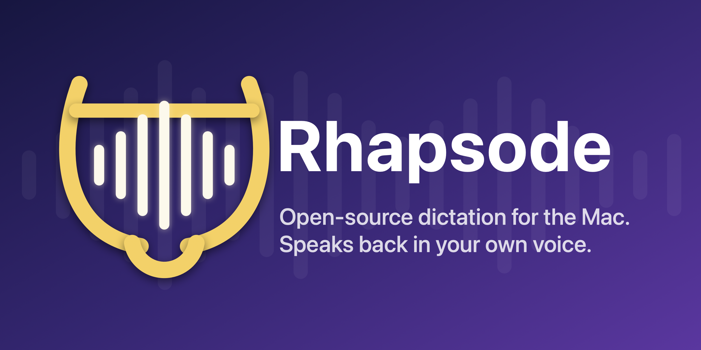

<p align="center">
  
</p>

<h1 align="center">Rhapsode</h1>

<p align="center">
  Free, open-source, two-way voice for your Mac.<br>
  A dictation app that rivals <a href="https://wisprflow.ai">Wispr Flow</a> — and talks back in your own voice.
</p>

<p align="center">
  <a href="https://github.com/vishk23/rhapsode/releases/latest"></a>
  
  
  
</p>

<p align="center">
  <sub>Built on <a href="https://github.com/zachlatta/freeflow">FreeFlow</a> by <a href="https://github.com/zachlatta">@zachlatta</a> · macOS 13+ · Apple Silicon &amp; Intel</sub>
</p>

---

<p align="center">
  
</p>

## What it does

Hold `Fn`, talk, release — clean text lands wherever your cursor is, in well under a second. Under the hood, every dictation runs a pipeline tuned far past basic Whisper-and-paste:

- **Fast cloud transcription** (Groq `whisper-large-v3-turbo`, ~0.6–0.9s round trip on a prewarmed connection) with **automatic on-device fallback**: if the provider is down, erroring, or just slow for 4 seconds, local whisper.cpp races it and the winner pastes. Wi-Fi off? Dictation still works, fully polished by Apple Intelligence — on-device, ~2s.
- **Hallucination defense** that actually verifies: Whisper's infamous trailing "Thank you." is stripped using *audio evidence* — if there was no voice energy during that segment's window, it never happened. Deliberate sign-offs survive.
- **Content-aware modes** — casual register in Messages/Slack, terse and code-safe in terminals, formal in Mail, standard elsewhere. Every mode is editable (Dashboard → Modes): your own prompt snippets, app and browser-tab routing, even a different cleanup model per mode. Custom modes outrank built-ins.
- **A dictionary that learns.** Add names once — or don't: after each paste the app watches (locally, via Accessibility) for your respellings and adds them automatically. Vocabulary flows into the Whisper prompt, a deterministic phonetic corrector ("grok" → "Groq", "duncan" → "Dunkin'"), and the cleanup LLM.
- **History you can audit** — every dictation browsable with Heard-vs-Cleaned comparison, original audio playback, one-click re-transcription, and failure badges. Stats, streaks, and WPM on the Dashboard.
- **Voice Bank → your voice, anywhere** *(the two-way part, opt-in)*: dictations build a local voice dataset; clone it via ElevenLabs, then select any text anywhere and press `⌥⌘S` to hear it read back in *your* voice.
- **Prompt-injection hardened**: dictating "write a poem about the moon" pastes those words — the cleanup layer is guarded against executing your speech as instructions, on both the cloud and on-device paths.

## Install

**Build from source** (a Mac with Xcode command-line tools):

```bash
git clone https://github.com/vishk23/rhapsode.git
cd rhapsode
make CODESIGN_IDENTITY=- ARCH=$(uname -m)   # ad-hoc signed dev build
open "build/Rhapsode Dev.app"
```

> Ad-hoc signing means macOS re-asks for permissions after each rebuild. If you have a Developer ID certificate, pass `CODESIGN_IDENTITY=<cert hash>` for grants that stick. `make release` builds a production-named app and a signed DMG (`brew install create-dmg fileicon` first).

**Setup**: first launch walks you through everything — Groq API key (free at [groq.com](https://groq.com)), microphone, accessibility, shortcuts, and a test dictation.

**Optional offline fallback**: Settings → Offline Fallback shows the two pieces — `brew install whisper-cpp` and a one-click 547 MB model download. Once both are green, network loss costs you ~1.5s per dictation instead of your dictation.

## How the pipeline works

```
Fn press ──▶ record (16kHz WAV) ──▶ trim trailing silence
   │                                     │
   │  (connection prewarms while         ▼
   │   you speak)                Groq whisper ◀──races after 4s──▶ local whisper.cpp
   │                                     │
   ▼                                     ▼
mode resolution              hallucination filter (audio-energy evidence)
(app / browser tab)                      │
   │                                     ▼
   └────────────▶ vocabulary corrector (phonetic, deterministic)
                                         │
                          cleanup LLM (mode-aware, injection-guarded)
                          └─ offline: filler strip + Apple Intelligence
                                         │
                                         ▼
                    smart-spaced paste (clipboard preserved & restored)
```

## How it compares

The short version: cloud-fast when the network is good, on-device when it isn't, learns your vocabulary like the commercial apps, and it's the only one that gives your voice back.

| | **Rhapsode** | Wispr Flow | VoiceInk | Handy | OpenWhispr |
|---|---|---|---|---|---|
| Price | Free (BYO API key, ~pennies/mo) | $12–15/mo | Freemium | Free | Free |
| Transcription | Cloud **+ auto on-device fallback + 4s hedge** | Cloud only | Local-first + cloud | Local only | Local + BYOK |
| Works offline | Yes — transcribed *and* polished on-device | No | Yes | Yes | Yes |
| Self-learning dictionary | Yes | Yes | No | No | Yes |
| Editable per-app modes | Yes, incl. browser-tab routing + per-mode model | Automatic only | Yes | No | Scoped prompts |
| Hallucination filtering | Audio-energy evidence per segment | Opaque | Regex | VAD prevention | Multi-guard |
| History w/ audio replay & re-transcribe | Yes | History | Yes | Basic | Yes |
| **Text → your cloned voice** | **Yes (⌥⌘S anywhere)** | No | No | No | No |
| Platforms | macOS | Mac/Win/iOS/Android | macOS | Mac/Win/Linux | Mac/Win |

Each of those projects is good at what it optimizes for — Handy for fully-local purity, VoiceInk for local-first Mac polish, Wispr Flow for multi-platform convenience. Rhapsode optimizes for one person's daily-driver on a Mac: lowest latency available at any moment, no subscription, every dictation auditable, and a voice that goes both directions.

## Privacy

No app server. Audio goes to your configured transcription provider (Groq by default) and text to your cleanup LLM — that's the entire data flow, and with the offline fallback installed you can dictate with zero network at all. The **Voice Bank is off by default** and local-only: nothing is ever uploaded unless you explicitly create an ElevenLabs voice clone, which is a separate deliberate action with your own API key.

## Requirements

- macOS 13+ (Apple Intelligence offline polish needs macOS 26+; ScreenCaptureKit context capture needs 14+)
- A free [Groq](https://groq.com) API key (or any OpenAI-compatible endpoint — configurable base URLs and models)
- Optional: [ElevenLabs](https://elevenlabs.io) key for voice cloning, `whisper-cpp` via Homebrew for offline

## Relationship to FreeFlow

This project is built on [FreeFlow](https://github.com/zachlatta/freeflow) and periodically merges its upstream improvements. Everything in "What it does" above beyond basic dictate-clean-paste — the resilience stack, learning dictionary, editable modes, offline pipeline, history browser, and the entire voice-bank/cloning direction — is this project. Both are MIT licensed; thanks to @zachlatta and the FreeFlow contributors for the excellent foundation.

## License

MIT — see [LICENSE](LICENSE).
